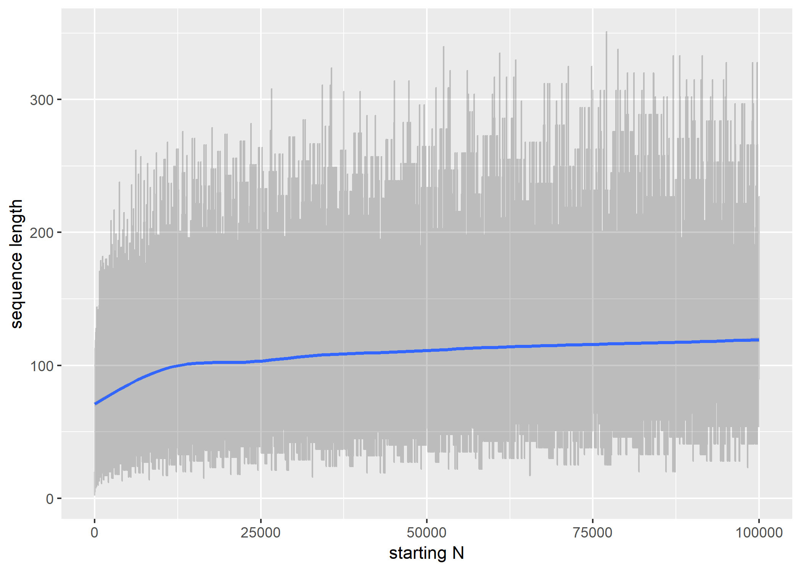

Collatz Sequences
================
Dan Reznik
April 2019

A Collatz *Sequence* starts with N, a positive integer. The next term in
the sequence is obtained from the current one as follows:

  - If current is even, next is half the current: `coll[i+1] =
    coll[i]/2`
  - If current is odd, next is 3 times the current plus 1: `coll[i+1]
    = 3*coll[i]+1`

The Collatz *Conjecture* states that for all starting N’s, the sequence
will always reach 1, explained
[here](https://en.wikipedia.org/wiki/Collatz_conjecture).

Below we investigate basics of Collatz sequences with starting N from 1
to 10k, namely:

  - for each N calculate the sequence and its length
  - pick a starting N (e.g, 27) which produces an unusually long
    sequence
  - study the distribution of the ratio of seq\_length/N
  - show the starting N’s with largest seq\_length/N ratios

Load libraries

``` r
library(tidyverse)
library(gtools) # for even()
library(furrr)
library(tictoc)
library(fs)
```

Calculate Collatz sequence with
`purrr::accumulate()`

``` r
collatz <- function(x,y) if (x%in%c(1L,2L)) done(1L) else if (even(x)) x/2L else 3L*x+1L
get_seq_seq <- function(x) (1L:10000L)%>%accumulate(collatz,.init=x)%>%as.integer
```

Compute (in parallel) first 1 million Collatz sequences, and show them
for N=20…30

``` r
fname_coll <- "data/df_coll.rds"
tic()
if (file_exists(fname_coll)) { # avoid long calc w/ knitr
  df_coll <- read_rds(fname_coll)
} else {
  plan(multiprocess)
  df_coll <- tibble(n=1:10^5,
                    coll=n%>%future_map(get_seq_seq),
                    seq_s=coll%>%map_chr(str_c,collapse=";"),
                    seq_max=coll%>%map_int(max),
                    seq_l=coll%>%map_int(length)) %>%
    select(n,seq_l,seq_max,seq_s)
  # Save it to RDS
  df_coll %>% write_rds(fname_coll,compress = "bz")
}
toc()
#> 1.89 sec elapsed
```

|  n | seq\_l | seq\_max | seq\_s                                                                                                                                                                                                                                                                                                                                                                                                                                                      |
| -: | -----: | -------: | :---------------------------------------------------------------------------------------------------------------------------------------------------------------------------------------------------------------------------------------------------------------------------------------------------------------------------------------------------------------------------------------------------------------------------------------------------------- |
| 20 |      8 |       20 | 20;10;5;16;8;4;2;1                                                                                                                                                                                                                                                                                                                                                                                                                                          |
| 21 |      8 |       64 | 21;64;32;16;8;4;2;1                                                                                                                                                                                                                                                                                                                                                                                                                                         |
| 22 |     16 |       52 | 22;11;34;17;52;26;13;40;20;10;5;16;8;4;2;1                                                                                                                                                                                                                                                                                                                                                                                                                  |
| 23 |     16 |      160 | 23;70;35;106;53;160;80;40;20;10;5;16;8;4;2;1                                                                                                                                                                                                                                                                                                                                                                                                                |
| 24 |     11 |       24 | 24;12;6;3;10;5;16;8;4;2;1                                                                                                                                                                                                                                                                                                                                                                                                                                   |
| 25 |     24 |       88 | 25;76;38;19;58;29;88;44;22;11;34;17;52;26;13;40;20;10;5;16;8;4;2;1                                                                                                                                                                                                                                                                                                                                                                                          |
| 26 |     11 |       40 | 26;13;40;20;10;5;16;8;4;2;1                                                                                                                                                                                                                                                                                                                                                                                                                                 |
| 27 |    112 |     9232 | 27;82;41;124;62;31;94;47;142;71;214;107;322;161;484;242;121;364;182;91;274;137;412;206;103;310;155;466;233;700;350;175;526;263;790;395;1186;593;1780;890;445;1336;668;334;167;502;251;754;377;1132;566;283;850;425;1276;638;319;958;479;1438;719;2158;1079;3238;1619;4858;2429;7288;3644;1822;911;2734;1367;4102;2051;6154;3077;9232;4616;2308;1154;577;1732;866;433;1300;650;325;976;488;244;122;61;184;92;46;23;70;35;106;53;160;80;40;20;10;5;16;8;4;2;1 |
| 28 |     19 |       52 | 28;14;7;22;11;34;17;52;26;13;40;20;10;5;16;8;4;2;1                                                                                                                                                                                                                                                                                                                                                                                                          |
| 29 |     19 |       88 | 29;88;44;22;11;34;17;52;26;13;40;20;10;5;16;8;4;2;1                                                                                                                                                                                                                                                                                                                                                                                                         |
| 30 |     19 |      160 | 30;15;46;23;70;35;106;53;160;80;40;20;10;5;16;8;4;2;1                                                                                                                                                                                                                                                                                                                                                                                                       |

The N=27 sequence

``` r
coll27 <- df_coll%>%filter(n==27)%>%pull(seq_s)
tibble(x=coll27%>%str_split(";")%>%first%>%as.integer)%>%mutate(i=row_number()) %>%
  ggplot(aes(i,x))+
  geom_line(color="blue") + geom_point(color="black") +
  scale_y_log10() + 
  labs(title="N=27",
       y="collatz[i] (log scale)",x="Iteration")
```


Plot sequence lengths vs starting N

``` r
df_coll %>%
  ggplot(aes(n,seq_l)) +
  geom_line(alpha=.2) +
  geom_smooth() +
  labs(x='starting N',y='sequence length')
#> `geom_smooth()` using method = 'gam' and formula 'y ~ s(x, bs = "cs")'
```



Mean and Median of length/n

``` r
map2_dbl(df_coll$seq_l,df_coll$n,~.x/.y)%>%mean
#> [1] 0.00657434
map2_dbl(df_coll$seq_l,df_coll$n,~.x/.y)%>%median
#> [1] 0.002203746
```

Top ten ratios of sequence lengths by starting N

``` r
df_coll %>%
  mutate(ratio=seq_l/n) %>%
  arrange(desc(ratio)) %>% 
  head(10) %>%
  mutate(rank=row_number(),ratio=round(ratio,2)) %>%
  select(rank,n,seq_l,ratio,everything()) %>%
  knitr::kable()
```

| rank |  n | seq\_l | ratio | seq\_max | seq\_s                                                                                                                                                                                                                                                                                                                                                                                                                                                             |
| ---: | -: | -----: | ----: | -------: | :----------------------------------------------------------------------------------------------------------------------------------------------------------------------------------------------------------------------------------------------------------------------------------------------------------------------------------------------------------------------------------------------------------------------------------------------------------------- |
|    1 | 27 |    112 |  4.15 |     9232 | 27;82;41;124;62;31;94;47;142;71;214;107;322;161;484;242;121;364;182;91;274;137;412;206;103;310;155;466;233;700;350;175;526;263;790;395;1186;593;1780;890;445;1336;668;334;167;502;251;754;377;1132;566;283;850;425;1276;638;319;958;479;1438;719;2158;1079;3238;1619;4858;2429;7288;3644;1822;911;2734;1367;4102;2051;6154;3077;9232;4616;2308;1154;577;1732;866;433;1300;650;325;976;488;244;122;61;184;92;46;23;70;35;106;53;160;80;40;20;10;5;16;8;4;2;1        |
|    2 | 31 |    107 |  3.45 |     9232 | 31;94;47;142;71;214;107;322;161;484;242;121;364;182;91;274;137;412;206;103;310;155;466;233;700;350;175;526;263;790;395;1186;593;1780;890;445;1336;668;334;167;502;251;754;377;1132;566;283;850;425;1276;638;319;958;479;1438;719;2158;1079;3238;1619;4858;2429;7288;3644;1822;911;2734;1367;4102;2051;6154;3077;9232;4616;2308;1154;577;1732;866;433;1300;650;325;976;488;244;122;61;184;92;46;23;70;35;106;53;160;80;40;20;10;5;16;8;4;2;1                        |
|    3 | 41 |    110 |  2.68 |     9232 | 41;124;62;31;94;47;142;71;214;107;322;161;484;242;121;364;182;91;274;137;412;206;103;310;155;466;233;700;350;175;526;263;790;395;1186;593;1780;890;445;1336;668;334;167;502;251;754;377;1132;566;283;850;425;1276;638;319;958;479;1438;719;2158;1079;3238;1619;4858;2429;7288;3644;1822;911;2734;1367;4102;2051;6154;3077;9232;4616;2308;1154;577;1732;866;433;1300;650;325;976;488;244;122;61;184;92;46;23;70;35;106;53;160;80;40;20;10;5;16;8;4;2;1              |
|    4 |  3 |      8 |  2.67 |       16 | 3;10;5;16;8;4;2;1                                                                                                                                                                                                                                                                                                                                                                                                                                                  |
|    5 |  7 |     17 |  2.43 |       52 | 7;22;11;34;17;52;26;13;40;20;10;5;16;8;4;2;1                                                                                                                                                                                                                                                                                                                                                                                                                       |
|    6 | 47 |    105 |  2.23 |     9232 | 47;142;71;214;107;322;161;484;242;121;364;182;91;274;137;412;206;103;310;155;466;233;700;350;175;526;263;790;395;1186;593;1780;890;445;1336;668;334;167;502;251;754;377;1132;566;283;850;425;1276;638;319;958;479;1438;719;2158;1079;3238;1619;4858;2429;7288;3644;1822;911;2734;1367;4102;2051;6154;3077;9232;4616;2308;1154;577;1732;866;433;1300;650;325;976;488;244;122;61;184;92;46;23;70;35;106;53;160;80;40;20;10;5;16;8;4;2;1                              |
|    7 |  9 |     20 |  2.22 |       52 | 9;28;14;7;22;11;34;17;52;26;13;40;20;10;5;16;8;4;2;1                                                                                                                                                                                                                                                                                                                                                                                                               |
|    8 | 54 |    113 |  2.09 |     9232 | 54;27;82;41;124;62;31;94;47;142;71;214;107;322;161;484;242;121;364;182;91;274;137;412;206;103;310;155;466;233;700;350;175;526;263;790;395;1186;593;1780;890;445;1336;668;334;167;502;251;754;377;1132;566;283;850;425;1276;638;319;958;479;1438;719;2158;1079;3238;1619;4858;2429;7288;3644;1822;911;2734;1367;4102;2051;6154;3077;9232;4616;2308;1154;577;1732;866;433;1300;650;325;976;488;244;122;61;184;92;46;23;70;35;106;53;160;80;40;20;10;5;16;8;4;2;1     |
|    9 | 55 |    113 |  2.05 |     9232 | 55;166;83;250;125;376;188;94;47;142;71;214;107;322;161;484;242;121;364;182;91;274;137;412;206;103;310;155;466;233;700;350;175;526;263;790;395;1186;593;1780;890;445;1336;668;334;167;502;251;754;377;1132;566;283;850;425;1276;638;319;958;479;1438;719;2158;1079;3238;1619;4858;2429;7288;3644;1822;911;2734;1367;4102;2051;6154;3077;9232;4616;2308;1154;577;1732;866;433;1300;650;325;976;488;244;122;61;184;92;46;23;70;35;106;53;160;80;40;20;10;5;16;8;4;2;1 |
|   10 |  1 |      2 |  2.00 |        1 | 1;1                                                                                                                                                                                                                                                                                                                                                                                                                                                                |

Plot density of sequence lengths divided by starting N. Can the mode be
computed?

``` r
df_coll %>%
  ggplot(aes(seq_l/n)) +
  geom_freqpoly(aes(y = ..density..)) +
  scale_x_log10() +
  labs(x='seq_length/starting N',
       y='density')
```


Happy Collatzing\!
